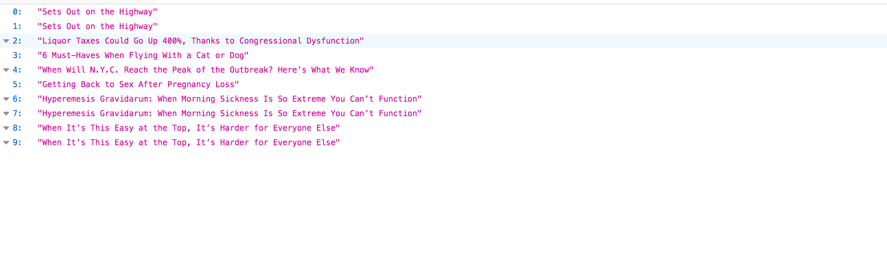

# PublishingReccomender
An end to end machine learning project using Cosine Similarity, TF-IDF Vectorizer, and Count Vectroizer to find the "weird" articles.
To request output from the rest endpoint, 

http://0.0.0.0:5001/getweird?Date="date"&n="numberofarticles" 

For example, http://0.0.0.0:5001/getweird?Date=2019-04-19&n=10 will give, 

